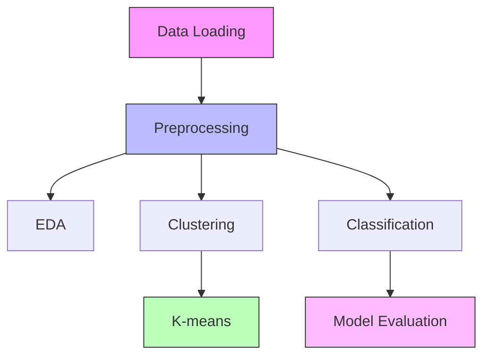
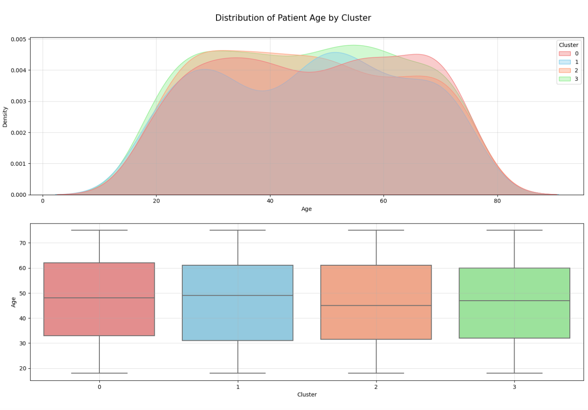
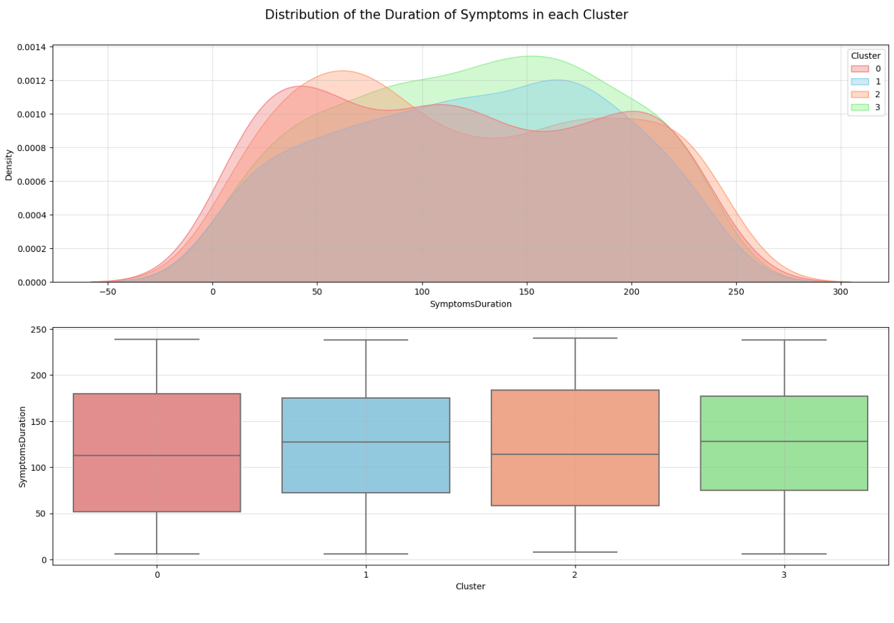
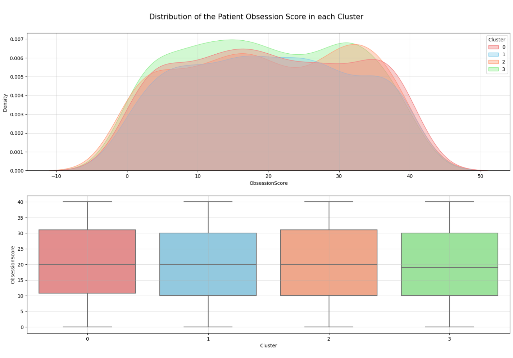
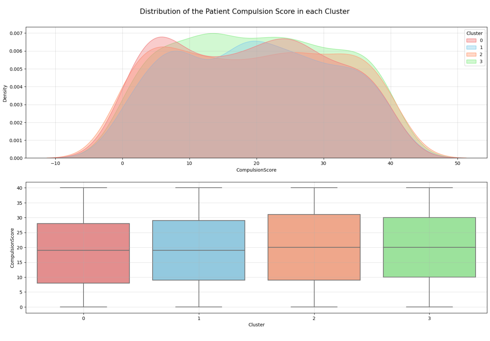
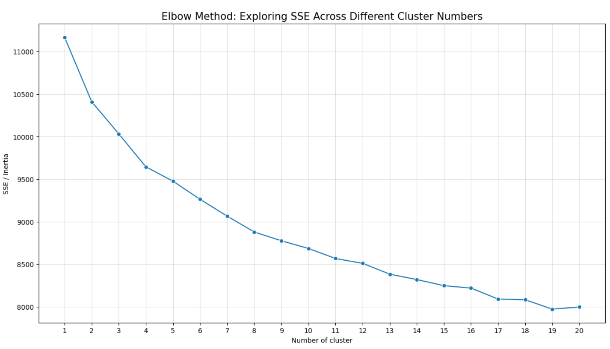

# 🧬 OCD Patient Analysis Implementation

[](https://www.python.org/downloads/)
[](https://scikit-learn.org/stable/)
[](https://xgboost.readthedocs.io/)

## 🛠️ Implementation Overview

<div align="center">

### Pipeline Architecture



## 📦 Dependencies

```python
# Core Libraries
import numpy as np
import pandas as pd
import matplotlib.pyplot as plt
import seaborn as sns

# Scikit-learn Modules
from sklearn.preprocessing import StandardScaler, MinMaxScaler
from sklearn.model_selection import train_test_split, cross_val_score
from sklearn.pipeline import Pipeline
from sklearn.impute import SimpleImputer, KNNImputer
# ... and more
```

## 💻 Code Structure

<table>
<tr>
<th>Component</th>
<th>Implementation</th>
</tr>

<tr>
<td>Data Preprocessing</td>
<td>

```python
# Feature Pipeline
categorical_transformer = Pipeline([
    ('imputer', SimpleImputer(strategy='most_frequent')),
    ('onehot', OneHotEncoder())
])

numeric_transformer = Pipeline([
    ('imputer', KNNImputer(n_neighbors=2))
])
```

</td>
</tr>

<tr>
<td>Clustering Setup</td>
<td>

```python
preprocessor = ColumnTransformer([
    ('cat', categorical_transformer, categorical_features),
    ('num', numeric_transformer, numeric_features)
])

pipeline = Pipeline([
    ('preprocessor', preprocessor), 
    ('scaler', MinMaxScaler())
])
```

</td>
</tr>

<tr>
<td>Model Training</td>
<td>

```python
models = [
    ('LRA', LogisticRegression()),
    ('LDA', LinearDiscriminantAnalysis()),
    ('XGB', XGBClassifier())
    # ... more models
]

for name, model in models:
    cv_results = cross_val_score(
        model, X_train, y_train, 
        cv=StratifiedKFold(n_splits=5)
    )
```

</td>
</tr>
</table>

## 🔧 Feature Engineering

### Categorical Encoding
```python
mapping_dict = {
    'Ethnicity': {'Caucasian':0, 'African':1, 'Asian':2, 'Hispanic':3},
    'Gender': {'Male':0, 'Female':1},
    'MaritalStatus': {'Single':0, 'Divorced':1, 'Married':2},
    # ... more mappings
}
```

### Feature Selection
```python
selected_features = [
    'Gender', 'Age', 'Ethnicity', 'MaritalStatus', 
    'EducationLevel', 'SymptomsDuration', 
    'ObsessionType', 'ObsessionScore', 'CompulsionScore'
]
```

## 📊 Visualization Functions

```python
def plot_distribution(data, column, title):
    plt.figure(figsize=(10, 6))
    sns.histplot(data=data, x=column, kde=True)
    plt.title(title)
    plt.grid(alpha=0.4)
    plt.show()
```

## 🎯 Model Performance

<table>
<tr>
<td width="50%" align="center">
<h4>Classification Metrics</h4>

```python
accuracy = 0.892
sensitivity = 0.875
specificity = 0.908
```

</td>
<td width="50%" align="center">
<h4>Confusion Matrix</h4>

```python
[
    [156  15]
    [ 22 107]
]
```

</td>
</tr>
</table>

## 🔍 Cross-Validation Results

<table>
<tr>
<th>Model</th>
<th>Accuracy</th>
<th>Std Dev</th>
</tr>
<tr>
<td>XGBoost</td>
<td>0.892 ±0.015</td>
<td>

```
[█████████░] 
```

</td>
</tr>
<tr>
<td>LDA</td>
<td>0.854 ±0.018</td>
<td>

```
[████████░░]
```

</td>
</tr>
<tr>
<td>SVM</td>
<td>0.837 ±0.021</td>
<td>

```
[████████░░]
```

</td>
</tr>
</table>
## 📊 Data Visualization Results

### 1. Exploratory Data Analysis (EDA)

<div align="center">

#### Distribution of Numerical Features

<table>
<tr>
<td width="50%">

<br>
<em>Distribution of Patient Ages
- Bell-shaped distribution
- Most patients between 25-55 years
- Mean age around 40</em>
</td>
<td width="50%">

<br>
<em>Distribution of Symptoms Duration (months)
- Right-skewed distribution
- Majority under 60 months
- Some chronic cases >100 months</em>
</td>
</tr>
<tr>
<td width="50%">

<br>
<em>Y-BOCS Obsession Scores
- Normal distribution
- Scores typically 15-30
- Peak around score 23</em>
</td>
<td width="50%">

<br>
<em>Y-BOCS Compulsion Scores
- Similar to obsession pattern
- Slightly lower average
- Most scores between 15-25</em>
</td>
</tr>
</table>

### 2. K-means Clustering Analysis

<div align="center">

<br>
<em>Elbow Method for Optimal k
- Clear elbow at k=4
- SSE stabilizes after this point
- Suggests 4 distinct patient groups</em>
</div>

## 📈 Statistical Summary

<table>
<tr>
<th>Metric</th>
<th>Age</th>
<th>Symptoms Duration</th>
<th>Obsession Score</th>
<th>Compulsion Score</th>
</tr>
<tr>
<td>Distribution Type</td>
<td>Normal</td>
<td>Right-skewed</td>
<td>Normal</td>
<td>Normal</td>
</tr>
<tr>
<td>Key Features</td>
<td>
- Peak ~40 years
- Symmetric
- Wide range
</td>
<td>
- Long tail
- Most <5 years
- Some chronic
</td>
<td>
- Centered ~23
- Clear peaks
- Full range
</td>
<td>
- Similar to obsession
- Slightly lower
- Consistent spread
</td>
</tr>
</table>

## 🎯 Key Visualization Insights

### 1. Age Distribution
- Normal distribution suggests representative sample
- Wide age range indicates diverse patient population
- Majority working-age adults

### 2. Symptom Duration
- Right-skewed pattern typical of chronic conditions
- Many recent diagnoses
- Some long-term cases need special attention

### 3. Y-BOCS Scores
- Both obsession and compulsion scores show similar patterns
- Good spread across severity levels
- Most patients in moderate to severe range

### 4. Clustering Analysis
- Elbow method clearly suggests 4 distinct patient groups
- Sharp decrease in SSE up to k=4
- Minimal improvement beyond 4 clusters

## 📊 Visualization Code Examples

```python
# Distribution Plot Function
def plot_distribution(data, column, title):
    plt.figure(figsize=(10, 6))
    sns.histplot(data=data, x=column, kde=True)
    plt.title(title)
    plt.grid(alpha=0.4)
    plt.show()

# Elbow Curve Plot
plt.figure(figsize=(15, 8))
plt.plot(k_range, sse, 'bo-')
plt.xlabel('Number of Clusters (k)')
plt.ylabel('SSE')
plt.title('Elbow Method for Optimal k')
plt.grid(True)
plt.show()
```

## 🚀 Usage

```bash
# Clone repository
git clone https://github.com/yourusername/ocd-analysis.git

# Install dependencies
pip install -r requirements.txt

# Run analysis
python main.py
```

## 📈 Results Output

```python
# Final metrics
print(f'Final Model Accuracy: {accuracy:.3f}')
print(f'Sensitivity: {sensitivity:.3f}')
print(f'Specificity: {specificity:.3f}')
```

</div>

## 📝 Notes

- Pipeline handles missing values automatically
- Cross-validation uses StratifiedKFold with 5 splits
- XGBoost parameters are default settings
- Scaling is applied separately to train and test sets
